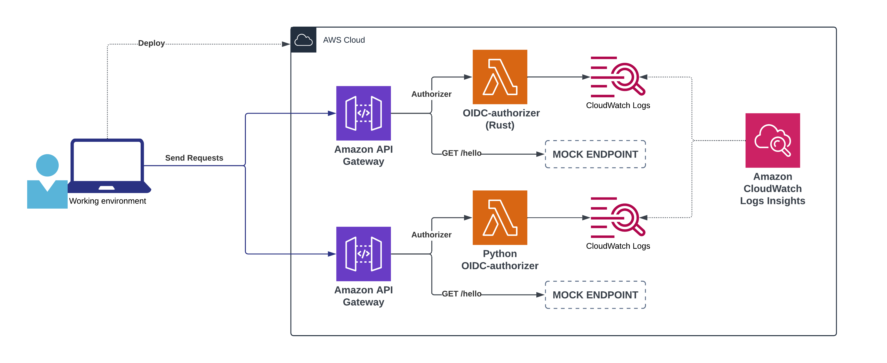

# oidc-authorizer-benchmark

A repo to benchmark https://github.com/lmammino/oidc-authorizer

The idea of this repository is to provide the necessary automation to perform a performance benchmark of the `oidc-authorizer` tool.

The benchmark also provides an alternative Python implementation of the same authorizer to compare the performance of the two implementations and to provide a reference point for the performance of the `oidc-authorizer`.


## Test architecture

The following diagram illustrates what's the high-level architecture of the benchmark:



The benchmark will provision two API Gateway, one for the `oidc-authorizer` and one for the alternative Python implementation. Each API Gateway will have a single MOCK endpoint that is protected by its authorizer.

Once a user deploys the necessary infrastructure, they will be able to send requests to the two endpoints and measure the performance of the authorizers.
This phase will send 10.000 requests with a frequency of 100 concurrent requests per second, on each API Gateway.

As the Lambda functions are invoked, the CloudWatch Logs will capture the performance metrics of the invocations. The benchmark will then use CloudWatch Logs Insights to query the logs and generate a report with the performance metrics.

> [!NOTE]
> The benchmark uses a custom load testing tool that will make sure to generate unique tokens for each request to avoid API Gateway caching. Also note that the 2 authorizer have been fine tuned for cost saving using [Lambda Power Tuning](https://serverlessrepo.aws.amazon.com/applications/arn:aws:serverlessrepo:us-east-1:451282441545:applications~aws-lambda-power-tuning). You can find some screenshots of the report in the `docs` folder.


## Requirements

- An AWS Account and the [AWS CLI](https://docs.aws.amazon.com/cli/latest/userguide/cli-chap-install.html) configured
- [SAM CLI](https://docs.aws.amazon.com/serverless-application-model/latest/developerguide/install-sam-cli.html)
- [Docker](https://docs.docker.com/get-docker/)
- [Just](https://github.com/casey/just)
- [Rust](https://www.rust-lang.org/tools/install)
- [jq](https://stedolan.github.io/jq/download/)


## How to run the benchmark

Before starting make sure that your current shell session is properly authenticated with the AWS CLI to the account where you want to run the benchmark.

### 1. Deploy the benchmark stack

```bash
just deploy-stack
```

### 2. Run the benchmark

```bash
just run # runs the Rust version
```

and

```bash
run-python # runs the Python version
```

### 3. Generate the report

Wait a couple of minutes to make sure all the logs are properly flushed into CloudWatch Log Groups.

Then, access the CloudWatch Logs Insights console and run the query in the `Log Insights report` section below.

### 4. Clean up

```bash
just delete-stack
```

> [!NOTE]
> At the moment the log groups are not deleted by the `delete-stack` command. You will have to manually delete them from the AWS Console.


## Log Insights report

### Query

```plain
filter @type = "REPORT"
| stats
  
  # Cold Start
  sum(strcontains(@message, "Init Duration")) as numColdStarts,
  count(*) as totalRequests,
  sum(strcontains(@message, "Init Duration"))/count(*) * 100 as coldStartPct,
  avg(@initDuration) as AvgInitDurationMs,
  percentile(@initDuration, 99) as p99InitDurationMs,
  percentile(@initDuration, 95) as p95InitDurationMs,
  percentile(@initDuration, 90) as p90InitDurationMs,
  min(@initDuration) as minInitDurationMs,
  max(@initDuration) as maxInitDurationMs,
  sum(@initDuration) as totalInitDurationMs,
  
  # Duration
  avg(@duration) as AvgDurationMs,
  percentile(@duration, 99) as p99DurationMs,
  percentile(@duration, 95) as p95DurationMs,
  percentile(@duration, 90) as p90DurationMs,
  min(@duration) as minDurationMs,
  max(@duration) as maxDurationMs,
  sum(@duration) as totalDurationMs,

  # Billed Duration
  avg(@billedDuration) as AvgBilledDurationMs,
  percentile(@billedDuration, 99) as p99BilledDurationMs,
  percentile(@billedDuration, 95) as p95BilledDurationMs,
  percentile(@billedDuration, 90) as p90BilledDurationMs,
  min(@billedDuration) as minBilledDurationMs,
  max(@billedDuration) as maxBilledDurationMs,
  sum(@billedDuration) as totalBilledDurationMs,

  # Memory Used
  avg(@maxMemoryUsed / 1000 / 1000) as avgMemoryUsedMB,
  percentile(@maxMemoryUsed / 1000 / 1000, 99) as p99MemoryUsedMB,
  percentile(@maxMemoryUsed / 1000 / 1000, 95) as p95MemoryUsedMB,
  percentile(@maxMemoryUsed / 1000 / 1000, 90) as p90MemoryUsedMB,
  min(@maxMemoryUsed / 1000 / 1000) as minMemoryUsedMB,
  max(@maxMemoryUsed / 1000 / 1000) as maxMemoryUsedMB,

  # Cost (price per 128MB in eu-west-1: ~$0.0000000016671875)
  sum(@billedDuration) as TotalExecutionMs,
  avg(@memorySize / 1000 / 1000) as MemorySizeMB,
  (avg(@memorySize / 1000 / 1000) / 128) * 0.0000000016671875 as CostUsdMs,
  CostUsdMs * TotalExecutionMs as TotalCostUsd
by @log
```

<details>

<summary>🔎 Query results (2024-05-01)</summary>

**CloudWatch Logs Insights**    
region: eu-west-1    
log-group-names: /aws/lambda/oidc-authorizer-benchmark-oidcautho-OidcAuthorizer-Q4ItiBPXLX4W, /aws/lambda/oidc-authorizer-benchmark-PythonOidcAuthorizer-cvtIXhsbmtW2    
start-time: 2024-05-01T18:14:13.000Z    
end-time: 2024-05-01T18:32:00.000Z    

---
| @log | numColdStarts | totalRequests | coldStartPct | AvgInitDurationMs | p99InitDurationMs | p95InitDurationMs | p90InitDurationMs | minInitDurationMs | maxInitDurationMs | totalInitDurationMs | AvgDurationMs | p99DurationMs | p95DurationMs | p90DurationMs | minDurationMs | maxDurationMs | totalDurationMs | AvgBilledDurationMs | p99BilledDurationMs | p95BilledDurationMs | p90BilledDurationMs | minBilledDurationMs | maxBilledDurationMs | totalBilledDurationMs | avgMemoryUsedMB | p99MemoryUsedMB | p95MemoryUsedMB | p90MemoryUsedMB | minMemoryUsedMB | maxMemoryUsedMB | TotalExecutionMs | MemorySizeMB | CostUsdMs | TotalCostUsd |
| --- | --- | --- | --- | --- | --- | --- | --- | --- | --- | --- | --- | --- | --- | --- | --- | --- | --- | --- | --- | --- | --- | --- | --- | --- | --- | --- | --- | --- | --- | --- | --- | --- | --- | --- |
| 208950529517:/aws/lambda/oidc-authorizer-benchmark-oidcautho-OidcAuthorizer-Q4ItiBPXLX4W | 100 | 10000 | 1 | 39.493 | 47.07 | 42.15 | 41.11 | 36.28 | 49.1 | 3949.3 | 7.6513 | 103.0298 | 15.8309 | 15.0947 | 0.89 | 216.67 | 76512.66 | 8.6514 | 140 | 16 | 16 | 1 | 217 | 86514 | 21.5805 | 24 | 22 | 22 | 19 | 24 | 86514 | 128 | 0.000000001667 | 0.0001442 |
| 208950529517:/aws/lambda/oidc-authorizer-benchmark-PythonOidcAuthorizer-cvtIXhsbmtW2 | 129 | 10000 | 1.29 | 637.8498 | 689.3387 | 676.3713 | 669.6446 | 574.12 | 693.43 | 82282.62 | 11.858 | 323.0797 | 16.0842 | 15.3362 | 1.99 | 436.52 | 118580.43 | 12.3877 | 333 | 17 | 16 | 2 | 437 | 123877 | 76.9072 | 82 | 77 | 77 | 74 | 82 | 123877 | 256 | 0.000000003334 | 0.0004131 |
---

The results are also available as a CSV in [`docs/logs-insights-results-2024-05-01.csv`](docs/logs-insights-results-2024-05-01.csv).

</details>


## Summary of the latest benchmark execution

Based on the numbers from my latest benchmark execution, these are some relevant findings when comparing `oidc-authorizer` with an equivalent Python implementation:

- The Rust version is about 16 times faster than the Python version when it comes to cold starts (~42ms vs ~670ms).
- Execution times are quite comparable between the two implementations, with the Rust version being only slightly faster. This is probably because the Python library used to do the JWT validation is quite optimized.
- Memory utilization is about 3.5 times smaller in Rust (22MB vs 77MB). This allows us to use a smaller memory size for the Rust version, which results in a lower cost.
- The cost per request is about 3 times smaller in Rust compared to Python (~1.44 USD vs ~4.13 USD per every 100Mln invocations).

It's worth noting that this kind of test has a very low cold start ratio (~1%) and the performance of the two implementations is quite comparable (except cost). In cases with a higher cold start ratio, the Rust version is expected to have a larger advantage in terms of performance and overall user experience.


## 🙌 Contributing

Everyone is very welcome to contribute to this project.
You can contribute just by submitting bugs or suggesting improvements by
[opening an issue on GitHub](https://github.com/lmammino/oidc-authorizer-benchmark/issues).


## 👨‍⚖️ License

Licensed under [MIT License](LICENSE). © Luciano Mammino.